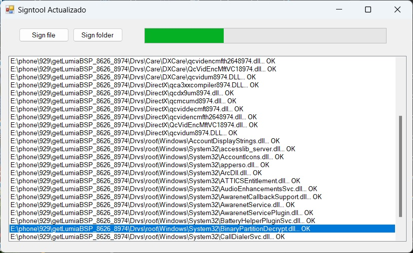

# ActualizacionSignTool
Bug-fixed self-sign tool for BSPs that are used to install Windows RT on Lumia phones.

### Highlights:
* Updated the timestamp server to resolve errors in the signing process.
* The style of the Select Folder dialog box has been modified so that it has a navigation bar at the top where you can enter a custom path, making it easier for the user to select the desired directory.
* A progress bar has been added to the signature process to give a more visual indication of progress.
* Supports drag-and-drop files for digital signing.
* Fixed some illogical interface layouts.

------

### Screenshot:

